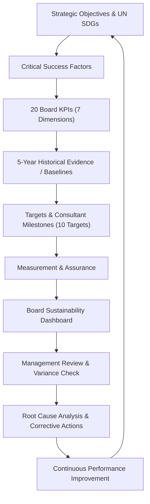

# Elpitiya Plantations PLC - Sustainability Management Performance Framework & Dashboard

## Executive Overview
**Course:** Ethics in Business and Sustainability  
**Organization:** Elpitiya Plantations PLC (EPP)  
**Target Audience:** The Board of Directors, Elpitiya Plantations PLC  
**Role:** Sustainability Consultants  
**Planning Horizon:** FY 2026/27 – FY 2030/31  
**Primary Evidence Base:** Five-Year Sustainability KPI and SDG Workbook (FY 2021/22 – FY 2025/26)  
**Application Directory:** `C:\Users\dinet\.gemini\antigravity-ide\scratch\elpitiya-sustainability-dashboard`

---

## 1. Executive Summary & Strategic Direction
The dashboard transitions Elpitiya Plantations PLC from **"ad-hoc sustainability data and activities"** to **"a single evidence-based sustainability performance system"** linking:
1. **5-Year Historical Baseline Evidence (FY21/22 – FY25/26)**
2. **United Nations Sustainable Development Goals (SDGs)**
3. **20 Board-Level Sustainability KPIs** across all 7 core dimensions
4. **10 Sustainability Consultant SDG Targets & Milestones**
5. **Clear Executive KPI Ownership**
6. **Closed-Loop PDCA (Plan-Do-Check-Act) Corrective Action Log**

---

## 2. The 20 Board-Level Sustainability KPIs (Appendix 1)

| No | Dimension | Framework KPI | Unit | Baseline (FY25/26) | Target / Direction | Primary SDG | Executive Owner |
|---|---|---|---|---|---|---|---|
| **1** | Environmental | Scope 1 + Scope 2 GHG Intensity | tCO2e/MT | TBE (8,013 tCO2e absolute) | Reduce further & establish intensity baseline | SDG 13 | Head of Sustainability + Operations |
| **2** | Environmental | % Material Scope 3 Categories Quantified | % | TBE | Quantify material Scope 3 categories | SDG 13 | Head of Sustainability + Operations |
| **3** | Environmental | Energy Intensity | GJ/MT | 6.39 GJ/MT | Lower than current; investigate rebound | SDG 7 | Engineering / Operations |
| **4** | Environmental | Renewable Electricity Generated / Consumed | % | TBE ratio | Increase renewable electricity ratio | SDG 7 | Engineering / Operations |
| **5** | Environmental | Operational Water Met via Rainwater | % | 59.0% | Increase rainwater share; investigate drop | SDG 6 | Estate Operations |
| **6** | Environmental | Freshwater Intensity | m3/MT | TBE | Establish baseline then reduce intensity | SDG 6 | Estate Operations |
| **7** | Environmental | Waste Diverted from Disposal | % | TBE (333 MT headline) | Establish diversion rate; expand composting | SDG 12 | Estate Managers + Sustainability |
| **8** | Environmental | Hectares Protected / Restored / Agroforestry | ha | TBE / Partial | Establish conservation baseline & expand | SDG 15 | Estate Managers + Agriculture |
| **9** | Social | Fatalities / High-Consequence Injuries | No. | 0 fatal; 0 high-conseq. | Maintain zero incidents | SDG 8 | HR / OHS + Estate Management |
| **10** | Social | Recordable Injury Count / Rate | No. / rate | 70 incidents | < 30 incidents (Target T08) | SDG 8 | HR / OHS + Estate Management |
| **11** | Social | Lost Hours from Work-Related Injuries | Hours | 2,236 lost hours | Continue downward trajectory | SDG 8 | HR / OHS + Estate Management |
| **12** | Social | Workforce Under Audited OHS System | % | TBE / Recent | Establish baseline & expand certification | SDG 8 | HR / OHS + Estate Management |
| **13** | Social | Average Formal Training Hours / Employee | Hours | 19.0 hrs (84,850 total) | Increase from 19 while linking to outcomes | SDG 4 | HR |
| **14** | Social | Female Representation in Senior Management | % | TBE (49% workforce) | Establish senior baseline & improve | SDG 5 | HR |
| **15** | Social | Voluntary Employee Turnover | % | TBE (Retention 82%) | Establish voluntary turnover baseline | SDG 8 | HR |
| **16** | Governance / Supply | High-Risk/New Suppliers Screened & Compliant | % | 140 screened; % TBE | Move from count to % screened & compliant | SDG 12 | Procurement |
| **17** | Governance | Scheduled Board Sustainability Reviews | % | TBE | 100% completion of scheduled reviews | SDG 16 | Company Secretariat / Compliance |
| **18** | Governance / Ethics | Substantiated Ethics Cases Closed in SLA | % | TBE | 100% closed within 30-day SLA | SDG 16 | Company Secretariat / Compliance |
| **19** | Financial / Innovation | Revenue from Value-Added / Diversification | % | TBE share | Establish baseline & grow value-added % | SDG 8 | CEO / CFO / Strategy |
| **20** | Stakeholder | Material Community Programmes with Outcomes | % | TBE (Rs. 146M, 24,989) | Increase independently measured outcomes | SDG 10 | Sustainability / Community Dev |

---

## 3. The 10 Sustainability Consultant SDG Target Register (Appendix 2)

- **T01 (SDG 2 - Zero Hunger):** Achieve zero hunger across EPP low-country operations by **2028**.
- **T02 (SDG 2 - Zero Hunger):** Extend zero-hunger outcome to up-country operations and group-wide by **2030**.
- **T03 (SDG 3 - Good Health):** Maintain an operational elderly home at Madakumbura by **FY 2026/27**.
- **T04 (SDG 3 - Good Health):** Commence construction/operation of 2nd elderly home at Dunsinane by **2028**.
- **T05 (SDG 4 - Education):** Use food-ration support to improve school attendance among students up to Grade 5 (**Ongoing / Quarterly**).
- **T06 (SDG 4 - Education):** Improve sanitary facilities across identified school environments (**Ongoing / Quarterly**).
- **T07 (SDG 8 - Decent Work):** Conduct 4 regional PPE/safety-wear awareness sessions per region per year (**Quarterly**).
- **T08 (SDG 8 - Decent Work):** Reduce and maintain recordable injuries below **30 incidents** (**Monthly**).
- **T09 (SDG 12 - Consumption):** Improve land-use efficiency through vertical-farming and hydroponic farming (**Ongoing / Quarterly**).
- **T10 (SDG 12 - Consumption):** Increase bio-fertiliser adoption and apply selective fertiliser where agronomically required (**Ongoing / Quarterly**).

---

## 4. Key Five-Year Historical Evidence Summary

| Indicator | Baseline (FY22) | Low Point | FY 2025/26 Actual | 5-Year Movement | Management Reading |
|---|---|---|---|---|---|
| **GHG Emissions (tCO2e)** | 8,151 | 6,817 (FY25) | 8,013 | -1.7% | FY26 rebound reversed previous low; Scope 1+2 intensity required |
| **Energy Intensity (GJ/MT)** | 7.17 (FY23) | 5.65 (FY25) | 6.39 | -10.9% | Improved vs FY23 baseline, but worsened from FY25 record low |
| **Rainwater Reliance (%)** | 49.0% | 49.0% (FY22) | 59.0% | +10 pp | Long-term up, but dropped sharply from 82.0% peak in FY25 |
| **Solid Waste (MT)** | 6,561 | 299 (FY25) | 333 | -94.9% | Major reported reduction; shifting to % waste diverted from disposal |
| **Employee Retention (%)** | 89.0% | 79.0% (FY25) | 82.0% | -7 pp | Rebounded from 79% low; still below 89% baseline |
| **Female Representation (%)** | 53.0% | 49.0% (FY24-26) | 49.0% | -4 pp | Stabilized at 49%; need senior management leadership breakdown |
| **Training Hours / Employee** | 1.5 hrs | 1.5 hrs (FY22) | 19.0 hrs | +1,166% | Massive capability expansion (84,850 total hrs); link to productivity |
| **Recordable Injuries** | N/A | N/A | 70 | -42.1% YoY | Down from 121 (FY25); pathway toward ceiling of <30 incidents |
| **Lost Hours from Injuries** | N/A | N/A | 2,236 | -57.3% YoY | Substantial drop from 5,237 hrs in FY25; zero fatalities maintained |
| **Supplier ESG Screening** | N/A | N/A | 140 | +133% YoY | Count increased from 60; converting to % screened & compliant |
| **Community Spending (Rs. Mn)**| Rs. 111 Mn | Rs. 111 Mn | Rs. 146 Mn | +31.5% | Reached 24,989 beneficiaries; transition to outcome impact metrics |

---

## 5. Dashboard Features & Capabilities

1. **Executive Command Center & 7-Dimension Scorecards:** Instant health overview across Environmental, Social, Safety, Governance, Stakeholder, and Innovation.
2. **Interactive 20 Board KPI Grid:** Dynamic filters by Dimension, Status, and Executive Owner, with full KPI drilldown modals.
3. **Multi-Series Chart.js Visualizations:** Interactive 5-year trend charts for GHG, Energy, Rainwater, Safety zero-harm pathway, Training, and Workforce.
4. **2030 Target Simulator:** Real-time sliders for solar share, rainwater harvesting, PPE sessions, and bio-fertiliser with instant 2030 outcome recalculations.
5. **10 Consultant Target Matrix:** Filterable by SDG and Status with milestone tracking and review cycles.
6. **UN SDG Alignment Matrix:** 10 Primary SDGs with historical coverage ratios and strategic priorities.
7. **PDCA Closed-Loop Action Log:** Full CRUD action tracker with pre-loaded root causes, corrective actions, budgets, and due dates.
8. **ESG Data Dictionary & Governance Rules:** Methodologies, sources, and data-quality boundaries.
9. **Export & Print Capabilities:** One-click CSV export and print-ready Board Briefing view.
10. **Modern Aesthetics:** Glassmorphism, smooth animations, dark/light luxury theme toggle, and responsive typography.
# Sustainability-Dashboard

# Sustainability-Dashboard

